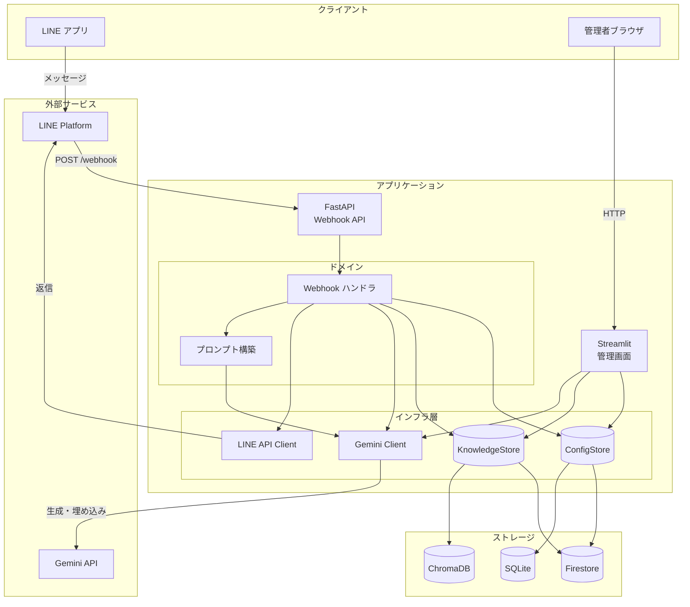

# システム構成図

## アプリケーション構成



## ディレクトリ構成

```
.
├── app/
│   ├── main.py              # FastAPI エントリポイント
│   ├── config.py            # 設定
│   ├── prompting.py         # プロンプト構築
│   ├── line/                # LINE 連携
│   │   ├── client.py        # Messaging API クライアント
│   │   ├── security.py      # 署名検証
│   │   └── dedup.py         # 重複排除
│   ├── llm/
│   │   └── gemini.py        # Gemini API クライアント
│   ├── rag/
│   │   ├── chroma_store.py       # ChromaDB 実装
│   │   └── firestore_knowledge_store.py  # Firestore ナレッジ実装
│   └── storage/
│       ├── config_store.py       # SQLite ロール実装
│       ├── firestore_config_store.py  # Firestore ロール実装
│       └── registry.py           # ストアファクトリ
├── streamlit_app.py         # 管理画面
├── deploy.sh                # デプロイスクリプト
├── Dockerfile.api           # FastAPI 用
├── Dockerfile.admin         # Streamlit 用
└── docs/                    # ドキュメント
```
