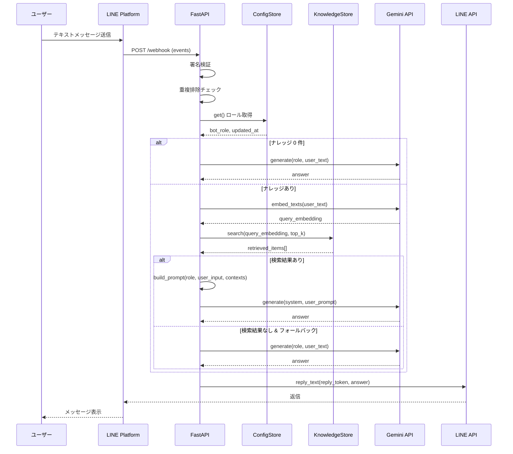
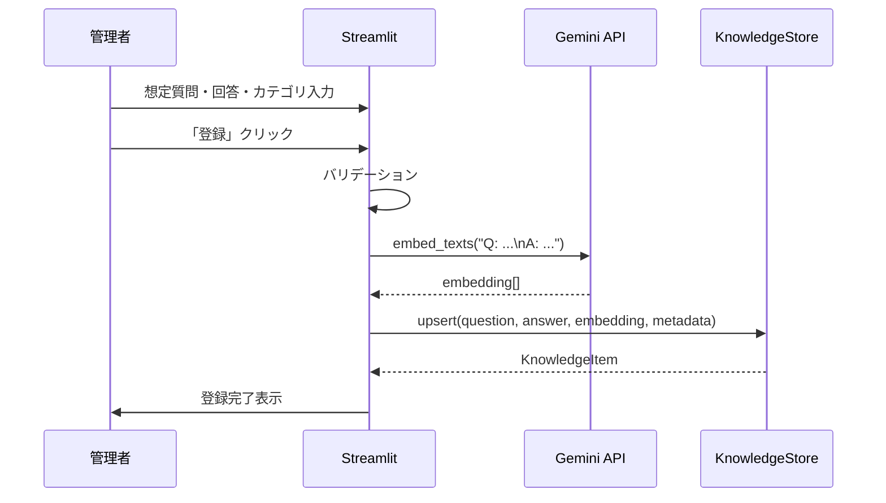
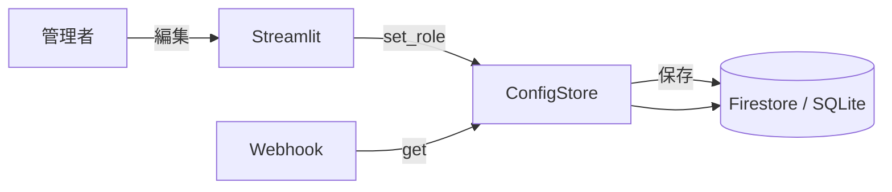
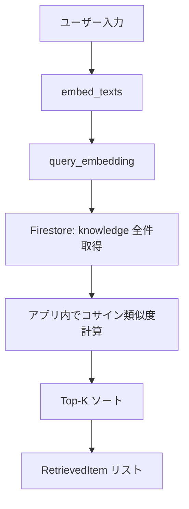

# データフロー図

## LINE メッセージ応答フロー

```mermaid
sequenceDiagram
    participant User as ユーザー
    participant LINE as LINE Platform
    participant API as FastAPI
    participant Config as ConfigStore
    participant Store as KnowledgeStore
    participant Gemini as Gemini API
    participant LineAPI as LINE API

    User->>LINE: テキストメッセージ送信
    LINE->>API: POST /webhook (events)
    API->>API: 署名検証
    API->>API: 重複排除チェック
    
    API->>Config: get() ロール取得
    Config-->>API: bot_role, updated_at
    
    alt ナレッジ 0 件
        API->>Gemini: generate(role, user_text)
        Gemini-->>API: answer
    else ナレッジあり
        API->>Gemini: embed_texts(user_text)
        Gemini-->>API: query_embedding
        API->>Store: search(query_embedding, top_k)
        Store-->>API: retrieved_items[]
        alt 検索結果あり
            API->>API: build_prompt(role, user_input, contexts)
            API->>Gemini: generate(system, user_prompt)
            Gemini-->>API: answer
        else 検索結果なし & フォールバック
            API->>Gemini: generate(role, user_text)
            Gemini-->>API: answer
        end
    end
    
    API->>LineAPI: reply_text(reply_token, answer)
    LineAPI-->>LINE: 返信
    LINE-->>User: メッセージ表示
```

## 管理画面（ナレッジ登録）フロー

```mermaid
sequenceDiagram
    participant Admin as 管理者
    participant Streamlit as Streamlit
    participant Gemini as Gemini API
    participant Store as KnowledgeStore

    Admin->>Streamlit: 想定質問・回答・カテゴリ入力
    Admin->>Streamlit: 「登録」クリック
    Streamlit->>Streamlit: バリデーション
    Streamlit->>Gemini: embed_texts("Q: ...\nA: ...")
    Gemini-->>Streamlit: embedding[]
    Streamlit->>Store: upsert(question, answer, embedding, metadata)
    Store-->>Streamlit: KnowledgeItem
    Streamlit->>Admin: 登録完了表示
```

## ロール更新フロー

```mermaid
flowchart LR
    A[管理者] -->|編集| B[Streamlit]
    B -->|set_role| C[ConfigStore]
    C -->|保存| D[(Firestore / SQLite)]
    
    E[Webhook] -->|get| C
    C --> D
```

## ベクトル検索フロー（Firestore の場合）

```mermaid
flowchart TD
    A[ユーザー入力] --> B[embed_texts]
    B --> C[query_embedding]
    C --> D[Firestore: knowledge 全件取得]
    D --> E[アプリ内でコサイン類似度計算]
    E --> F[Top-K ソート]
    F --> G[RetrievedItem リスト]
```
