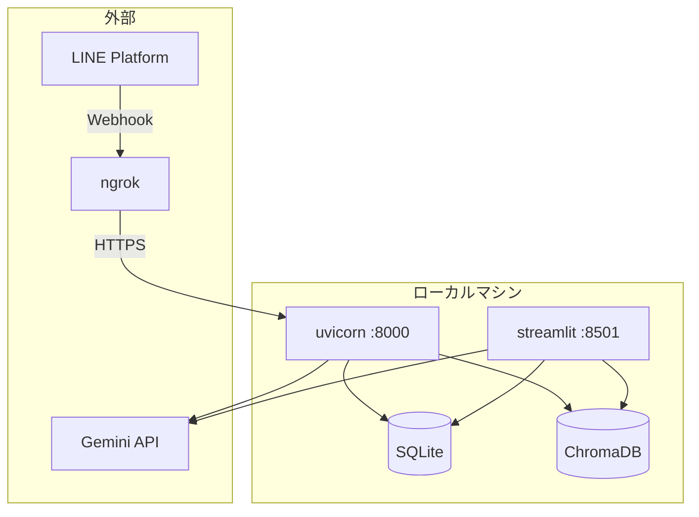
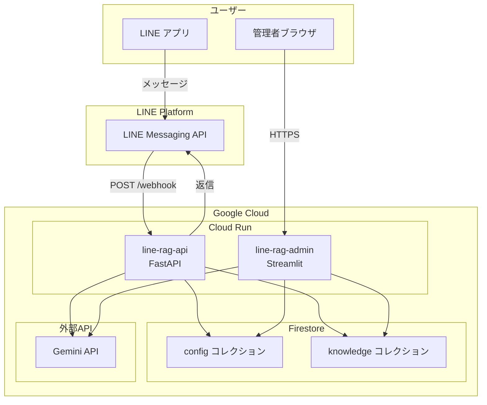
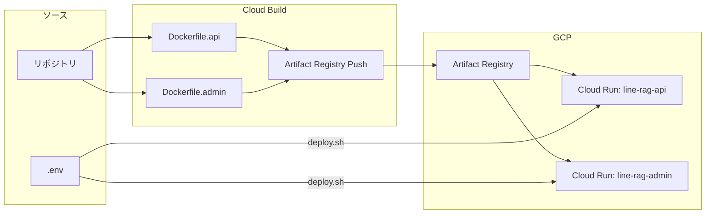

# インフラ構成図

## ローカル開発環境

## Cloud Run 本番環境（案A: 完全無料寄り）

## デプロイパイプライン

## ネットワーク構成

| コンポーネント | 入力 | 出力 |
|----------------|------|------|
| line-rag-api | LINE Webhook (HTTPS) | Firestore, Gemini API, LINE API |
| line-rag-admin | 管理者ブラウザ (HTTPS) | Firestore, Gemini API |
| Firestore | Cloud Run サービス | - |
| Gemini API | Cloud Run サービス | - |
