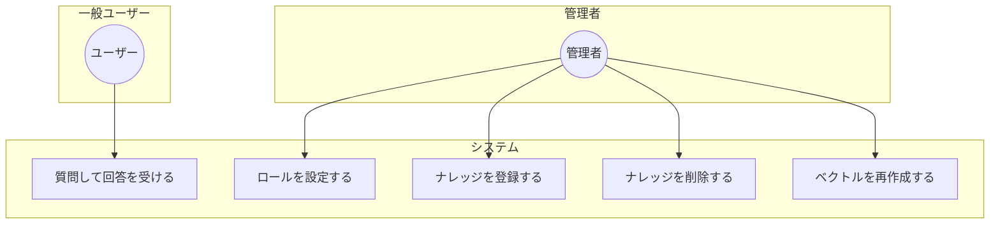
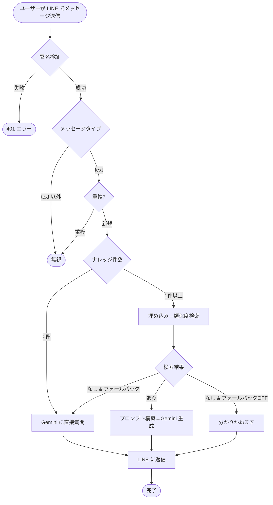
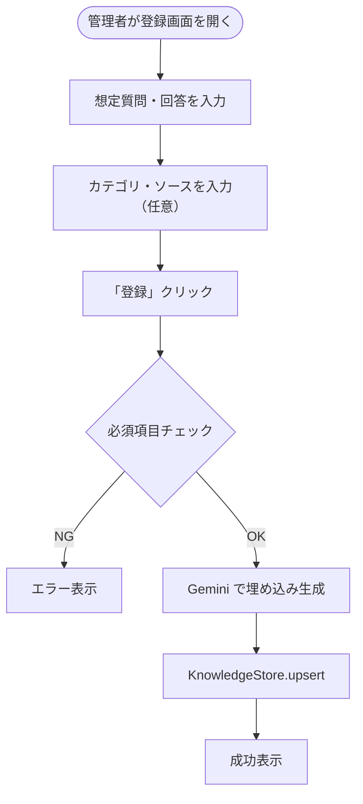

# ユースケース図

## 全体図



## ユースケース一覧

| ID | ユースケース | アクター | 説明 |
|----|--------------|----------|------|
| UC1 | 質問して回答を受ける | ユーザー | LINE でテキストを送信し、RAG/LLM による回答を受け取る |
| UC2 | ロールを設定する | 管理者 | 管理画面で Bot のキャラクター・振る舞い（System Instruction）を設定する |
| UC3 | ナレッジを登録する | 管理者 | 想定Q&A、カテゴリ、ソースを登録し、埋め込みを保存する |
| UC4 | ナレッジを削除する | 管理者 | 登録済みナレッジを選択して削除する |
| UC5 | ベクトルを再作成する | 管理者 | 全件を再埋め込みしてベクトルDBを更新する |

## UC1: 質問して回答を受ける（詳細）



## UC3: ナレッジを登録する（詳細）



## アクターとシステム境界

```mermaid
flowchart LR
    subgraph 外部
        User[ユーザー]
        Admin[管理者]
    end

    subgraph LINE_RAG_Bot["LINE RAG Bot システム"]
        subgraph API["FastAPI"]
            Webhook[/webhook]
        end
        subgraph UI["Streamlit"]
            RoleTab[ロールタブ]
            KnowledgeTab[ナレッジタブ]
        end
    end

    User -->|メッセージ送受信| Webhook
    Admin -->|ロール編集| RoleTab
    Admin -->|Q&A登録/削除/再埋め込み| KnowledgeTab
```
